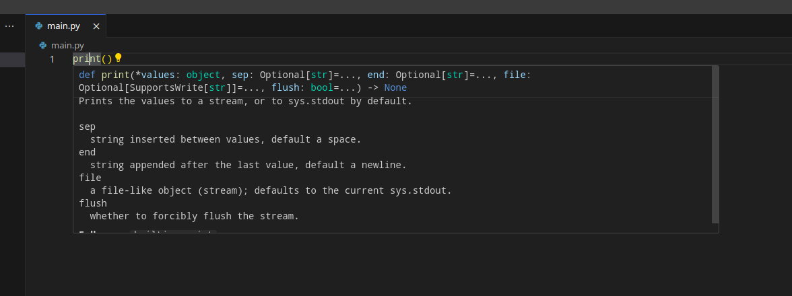

# Что такое `*args` и `**kwargs` в Python


> Автор: Евгений Кучерявый

Просматривая чужой код или документацию Python, вы могли натыкаться на такие названия аргументов как `*args` и `**kwargs`. Сегодня мы рассмотрим для чего они нужны.

Давайте посмотрим на вот этот кусок кода:

```
#!/usr/bin/env python

name = input('What is your name? ')
print('Hello', name)

```

Тут мы спрашиваем у пользователя его имя, а потом выводим надпись `Hello, Имя пользователя`. И хотя есть много разных способов объединить две строки (конкатенация, интерполяция, форматирование), мы выбрали просто перечислить наши значения через запятую для метода `print()`.

Если вы создавали свои методы, то знаете, что для них можно указать любое количество параметров, которые нужны для вызова этого самого метода. Но как тогда работает метод `print()`? Разве разработчики Python создавали этот метод, указав большое количество параметров?

На самом деле, всё гораздо проще. И для демонстрации, давайте посмотрим на подсказку, которую даёт нам IDE при наведении на метод.



Как мы видим, вместо бесконечного количества атрибутов здесь указан такой параметр как `*values` — это есть тот самый `*args`, о котором мы будем говорить (про `**kwargs` тоже не забудем).

## Использование `*args` и `**kwargs` в Python

Самый простой способ узнать, что это такое и как оно используется, это написать метод, который принимает такие аргументы, а потом вывести их с помощью `print()`.

```
#!/usr/bin/env python

def func(*args, **kwargs):
   print(args, kwargs)


func(1, 2, 3, 4, 5, 6, something=123, value=2)

```

Результат будет следующий:

```
evgenii@kucheriavyi λ ~/  » python main.py
(1, 2, 3, 4, 5, 6) {'something': 123, 'value': 2}
evgenii@kucheriavyi λ ~/  »

```

Как мы видим, `*args` превратился в кортеж с переданными нами значениями без имени. А `**kwargs` это уже именованные атрибуты в словаре. `*args` — сокращение от arguments (с англ. аргументы). А `**kwargs` — сокращение от keyworded arguments (с англ. аргументы с ключами).

> Обратите внимание, что в `print()` значения передались без звёздочек. Если их поставить, то аргументы применятся к методу `print()`.

По сути, мы могли бы не париться с этими звёздочками и просто передавать кортеж и словарь. Но почему разработчики языка решили, что такой синтаксический сахар стоит добавления в язык?

Допустим, я хочу измерить скорость работы любого метода. Тогда если я не знаю про `*args` и `**kwargs`, то мне придётся туго — я буду копипастить одни и те же строчки снова и снова.

```
#!/usr/bin/env python
from time import monotonic


start = monotonic()
func1(1)
print('Execution time:', monotonic()-start)

start = monotonic()
func2(2)
print('Execution time:', monotonic()-start)

start = monotonic()
func3(3)
print('Execution time:', monotonic()-start)

```

Если же такая особенность Python мне знакома, то всё сильно упрощается.

```
#!/usr/bin/env python
from time import monotonic, sleep


def func(sleep_time):
    sleep(sleep_time)


def test_speed(method, *args, **kwargs):
    print('Testing speed for method: ', method.__name__)
    start = monotonic()

    method(*args, **kwargs)
    end = monotonic()

    print('Execution time:', end-start)


test_speed(func, sleep_time=2)

```

> `*args` и `**kwargs` — важные инструменты при работе с декораторами.

## Заключение

Мы разобрали один из примеров работы с именованными и неименованными атрибутами для методов в Python. На самом деле их достаточно много и они часто используются.
