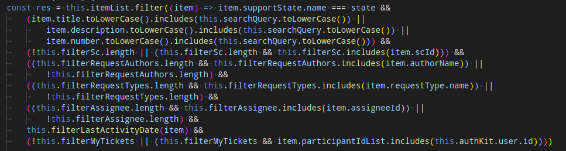

# EsLint


> Автор: Евгений Кучерявый

> Часть серии [Стартап который смог](/articles/startup-smog/).

Что если я скажу, что у вас есть возможность почти без усилий, настроив небольшой конфиг, улучшить качество кода по всему проекту? Неверится? А это на самом деле возможно с помощью линтера — утилиты, которая проверяет соблюдение определённых правил в коде и даже может автоматически вносить испровления.

Для JavaScript/TypeScript популярное решение — [eslint](https://eslint.org/). Перейдите по ссылке, установите его себе и возвращайтесь сюда. Мы будем говорить о полезных правилах и некоторых особенностях.

> Линтер часто инициализируется вместе с фреймворком/библиотекой.

## Что вообще за правила такие, или Никаких warnings

Сколько проектов, столько и кодстайлов. И если бы линтер навязывал разработчикам единственно верный набор правил, то его никто бы не использовал. Поэтому у вас есть возможность настроить линтер под себя:

- `indent` — используются табы или пробелы;
- `quotes` — кавычки одинарные или двойные;
- `comma-dangle` — ставится запятая у последнего элемента массива или нет;
- `import/prefer-default-export` — используется экспорт по умолчанию или именованный;
- и так далее.

Правила есть на любой вкус, можно даже [писать свои](https://eslint.org/docs/latest/extend/).

К каждому из приведённых выше примеров можно подобрать аргументацию как «за», так и «против» обоих вариантов. Может быть эти аргументы даже будут валидные, но в целом это вкусовщина. Тут важно кое-что другое — один раз настроив правило, даже наугад, вы гарантируете консистентность кода (по этому конкретному правилу).

Считаю своим долгом ответить на вопрос «Зачем вообще нужна однородность кода?»: единообразие приводит к предсказуемости. А предсказуемость позволяет быстрее находить, читать, редактировать старые фрагменты кода и добавлять новые.

Кроме того, что можно настроить любое правило, вы ещё можете указать реакцию на его нарушение. НИКОГДА не ставьте `warning` — такие правила игнорируются как разработчиками, так и автофиксами. Кстати о последних.

## Осторожное использование AutoFix

[Автоматические исправления](https://eslint.org/docs/latest/use/command-line-interface#fix-problems) — это очень круто, но доработать немного тут и там напильником всё равно придётся. Скрипт не всегда справляется с тем, чтобы корректно внести изменения. Особенно, если поправить нужно что-то такое:



*Тернарный венец (это не постановка)*

Ещё один пример, где нужно быть осторожнее:

```
function ExampleComponent() {
	const [value, setValue] = useState(false)

	const handleClick = () => {
		setValue(true)
	}

	return <button onClick={() => { handleClick() }>Click me!</button>
}
```

С точки зрения линтера лишний тут `value` — он нигде не используется. Но если его удалить компонент сломается, потому что `setValue` перестанет быть методом. С точки зрения человека лишний тут `useState` или даже компонент целиком.

> А может тут неправильно подобрано правило?

При этом отказываться от автофиксов глупо — можно запуском одной команды превратить весь код в что-то более красивое и понятное. Особенно, если это какое-то не сильно напряжное изменение вроде замены пробелов на табы. Согласитесь, делать это вручную в трёх тысячах файлов будет не так весело.

В следующем блоке как раз поговорим о том, как эффективно вводить новые правила, чтобы ничего не ломалось, а команда была довольна.

## Как вводить новые правила и не сойти с ума

> Для полного понимания почитайте статью про [GitFlow](/articles/gitflow).

Если проект новый, просто подготовьте список правил заранее и накатите их сразу. То же самое, если проект живёт уже какое-то время, но вы на нём единственный разработчик. Но тут важно помнить про проблемы с автофиксами.

Ситуация становится интереснее, когда проект разрабатывают команда, а количество файлов переваливает за несколько тысяч. Тут подход уже немного другой:

### 1. **Заводим тикеты под правила**

Количество тикетов зависит от того, насколько злостно они (правила) нарушались (до того, как их ввели — всё логично). Что-то можно объединить в общий тикет и влить разом.

### 2. **Выбираем оптимальное время влития изменений**.

Тут уже зависит от каждого конкретного правила. Например, правило `indent` затронет ВСЕ файлы, но конфликты по нему решаются относительно легко.

Пожёстче ситуация с `max-depth` и `max-nested-callbacks`. Они могут затрагивать только часть файлов, иногда даже небольшую. Но каждое конкретное исправление нужно проконтроллировать лично. Как вариант, можно постепенно ужесточать политику относительно максимальной вложенности. Сначала находим самую глубокую точку — допустим 6 — и указываем её как лимит. Ура! Вы в яме, но хотя бы перестали копать.

Дальше уже можно постепенно ужесточать правило и исправлять ошибки.

## Полезные правила

Перед тем как ещё немного побрюзжать в заключении, вот небольшая табличка.

> **Легенда влияния:**
> - «**Приложение**» — нарушение правила напрямую или косвенно ухудшает работу приложения или создаёт благоприятную среду для появления багов.
> - «**Опыт разработки**» — нарушение правила нарушает консистентность кода или заставляет о ней думать и править всё руками.

<table>
	<thead>
		<tr>
			<th>№</th><th>Правило</th><th>Описание</th><th>Влияет на</th>
		</tr>
	</thead>
	<tbody>
		<tr>
			<td>1</td><td>`no-console`</td><td>Можно даже не пытаться переучивать людей с `console.log()` на дебагер. Но запретить тащить это в релиз мы обязаны.</td><td>Приложение</td>
		</tr>
		<tr>
			<td>2</td><td>`no-unused-vars`</td><td>Запрет на объявление неиспользуемых переменных.</td><td>Приложение</td>
		</tr>
		<tr>
			<td>3</td><td>`no-unused-expressions`</td><td>Запрет на объявление неиспользуемых выражений.</td><td>Приложение</td>
		</tr>
		<tr>
			<td>4</td><td>`eol-last`</td><td>Принудительная пустая строка в конце файлов.</td><td>Приложение</td>
		</tr>
		<tr>
			<td>5</td><td>`linebreak-style`</td><td>Стиль записи переноса строки в файле. Рекомендуется `unix`. Правило кажется безобидным, пока у вас не появятся конфликты из-за того, что кто-то из разработчиков сидит на винде. Можно задублировать в `.editorconfig`, но серьёзно рассчитывать на него не стоит.</td><td>Приложение</td>
		</tr>
		<tr>
			<td>6</td><td>`max-depth`</td><td>Максимальная вложенность блоков кода — не более 4. У нас есть об этом <a href="/articles/pochemu-vloshennost-eto-ploho">статья</a>. Недостаток этого правила в том, что отсчёт идёт от начала текущего метода.</td><td>Приложение</td>
		</tr>
		<tr>
			<td>7</td><td>`max-nested-callbacks`</td><td>Брат прошлого правила, решающий проблему с вложенными друг в друга методами.</td><td>Приложение</td>
		</tr>
		<tr>
			<td>8</td><td>`eqeqeq`</td><td>Должно ли отдаваться предпочтение `===` вместо `==`. Тут рекомендуется значение `smart`, чтобы совсем не душить. Но и в радикальном `error` тоже ничего плохого нет.</td><td>Приложение</td>
		</tr>
		<tr>
			<td>9</td><td>`no-param-reassign`</td><td>Запрет на изменение значений аргументов внутри методов.</td><td>Приложение</td>
		</tr>
		<tr>
				<td>10</td><td>`consistent-return`</td><td>Запрет на неоднородный возврат значений в методах.</td><td>Приложение</td>
		</tr>
		<tr>
			<td>11</td><td>`no-nested-ternary`</td><td>Запрет на использование вложеных тернарников.</td><td>Приложение</td>
		</tr>
		<tr>
			<td>12</td><td>`no-restricted-globals`</td><td>Запрет на использование определённых глобальных значений: `event`, `alert`, `error` и так далее.</td><td>Приложение</td>
		</tr>
		<tr>
			<td>13</td><td>`no-useless-escape`</td><td>Запрет на экранирование символов без необходимости.</td><td>Приложение</td>
		</tr>
		<tr>
			<td>14</td><td>`no-template-curly-in-string`</td><td>Запрет на использоваение интерполяции в строках с обычными кавычками.</td><td>Приложение</td>
		</tr>
		<tr>
			<td>15</td><td>`prefer-const`</td><td>Использование констант, если значение не меняется.</td><td>Приложение</td>
		</tr>
		<tr>
			<td>16</td><td>`naming-convention`</td><td>Конвенция именования переменных: `camelCase`, `PascalCase`, `snake_case`.</td><td>Опыт разработки</td>
		</tr>
		<tr>
			<td>17</td><td>`import/prefer-default-export`</td><td>Используется экспорт по умолчанию или именованный.</td><td>Опыт разработки</td>
		</tr>
		<tr>
			<td>18</td><td>`no-trailing-spaces`</td><td>Запрет на пробелы и табы в конце строк.</td><td>Опыт разработки</td>
		</tr>
		<tr>
			<td>19</td><td>`indent`</td><td>Что используется для индентации — табы или пробелы. Я верю в превосходство табов.</td><td>Опыт разработки</td>
		</tr>
		<tr>
			<td>20</td><td>`no-unreachable`</td><td>Запрет на недостижимый код (например, который стоит после `return`.</td><td>Опыт разработки</td>
		</tr>
		<tr>
			<td>21</td><td>`no-useless-return`</td><td>Запрет на бесмыссленый `return`.</td><td>Опыт разработки</td>
		</tr>
		<tr>
			<td>22</td><td>`max-len`</td><td>Максимальная длина строки. Желательно не более 150—160.</td><td>Опыт разработки</td>
		</tr>
		<tr>
			<td>23</td><td>`keyword-spacing`</td><td>Нужен ли пробел между ключевыми словами и скобками: `if(true)` или `if (true)`.</td><td>Опыт разработки</td>
		</tr>
		<tr>
			<td>24</td><td>`object-curly-spacing`</td><td>Нужны ли пробелы до/после фигурных скобок.</td><td>Опыт разработки</td>
		</tr>
		<tr>
			<td>25</td><td>`object-curly-newline`</td><td>Нужны ли переносы строк до/после фигурных скобок.</td><td>Опыт разработки</td>
		</tr>
		<tr>
			<td>26</td><td>`array-bracket-spacing`</td><td>Нужны ли пробелы до/после квадратных скобок.</td><td>Опыт разработки</td>
		</tr>
		<tr>
			<td>27</td><td>`quotes`</td><td>Используются одинарные или двойные кавычки.</td><td>Опыт разработки</td>
		</tr>
		<tr>
			<td>28</td><td>`semi`</td><td>Должна ли после выражения стоять точка с запятой.</td><td>Опыт разработки</td>
		</tr>
		<tr>
			<td>29</td><td>`no-multiple-empty-lines`</td><td>Запрет на несколько пустых строк подряд.</td><td>Опыт разработки</td>
		</tr>
		<tr>
			<td>30</td><td>`comma-dangle`</td><td>Нужно ли ставить запятую в конце списков/массивов.</td><td>Опыт разработки</td>
		</tr>
	</tbody>
</table>

Также существуют специфические правила под TypeScript, разные фреймворки и библиотеки. Их реально очень много, описывать все нет смысла. Тем более у вас уже есть ссылка на документацию.

Отдельная песня — пресеты. Кто-то уже собрал наборы правил, который можно подключить в пару строк. Мы, например, используем `airbnb-base`.

> Обновление: часть правил из списка выше были [отмечены устаревшими 26.10.2023](https://eslint.org/blog/2023/10/deprecating-formatting-rules/).

## Вместо заключения: линтер не спасёт от всего

Линтер помогает нам добиться консистентности кода и запретить использования некоторых плохих практик. Однако как панацею его воспринимать не стоит. Он не заставит ваших разработчиков писать только чистый код, скорее просто вынудит проявлять больше фантазии, чтобы навалить плохого.

Для меня лично главная заслуга линтера в том, что он позволяет разгрузить мысленные ресурсы с оформления кода, на решение бизнес-задач.

Ну и, конечно же, всегда есть дополнительные инструменты, которые помогут ускорить разработку и повысить качество кода: [Prettier](https://prettier.io/), [Stylelint](https://stylelint.io/), [EditorConfig](https://editorconfig.org/), разные AI-помощники и так далее.

> Остались вопросы или нужна консультация?  
>Пишите в телеграм: [@e_kucheriavyi](https://t.me/e_kucheriavyi)

