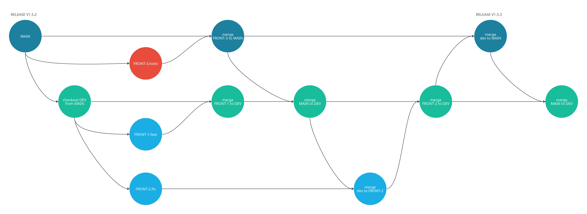
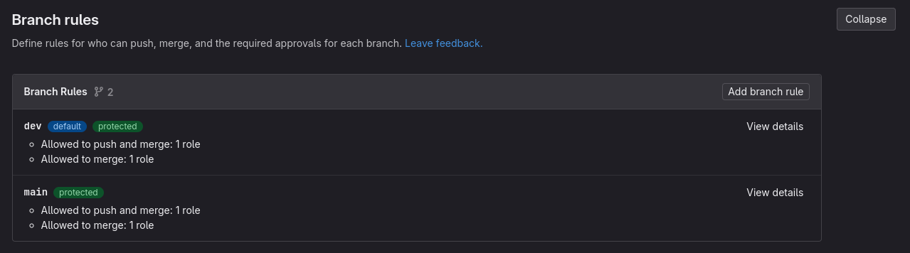
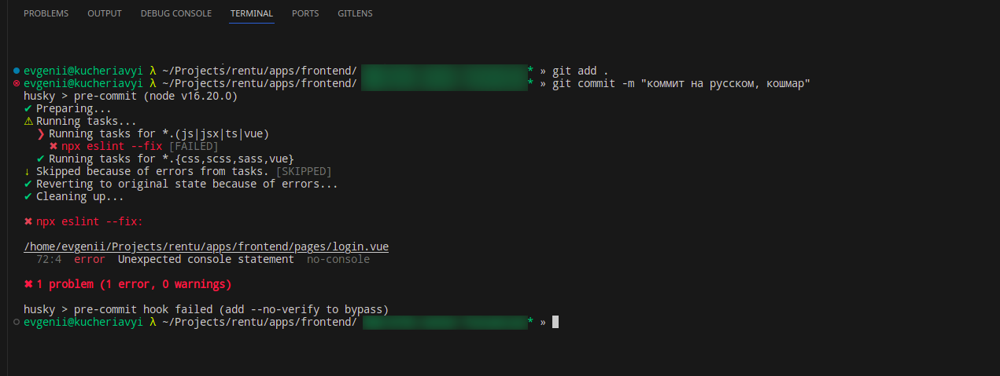
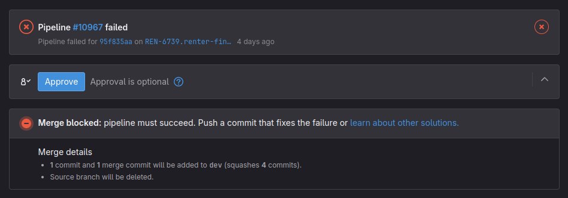
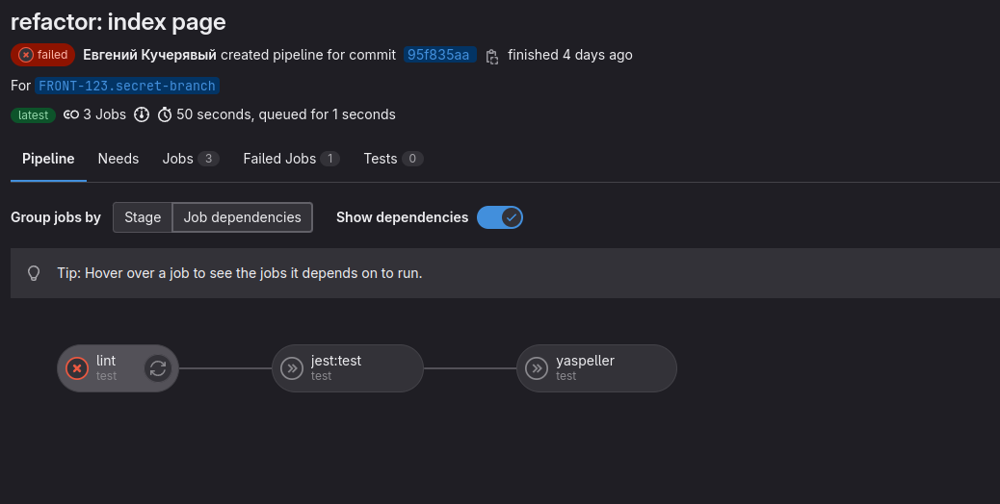
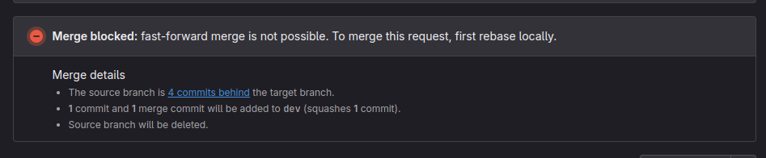
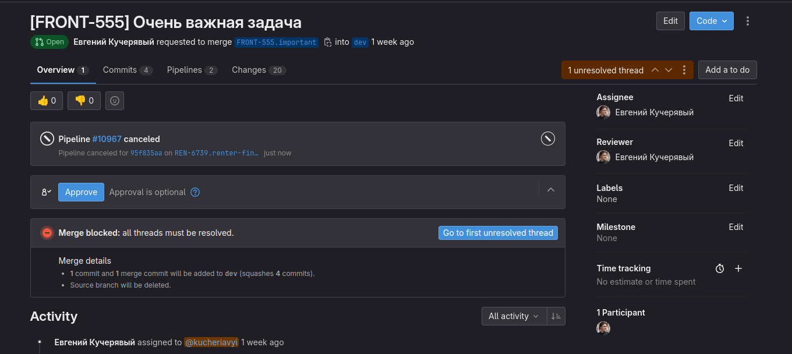

# Gitflow

> Автор: Евгений Кучерявый

> Часть серии [Стартап который смог](/articles/startup-smog/).

**GitFlow** (**git** — система конктроля версий; англ. **flow** — поток) — это то, как команда разработки использует систему контроля версий. Когда у вас один человек на незапущенном проекте, в целом как-то без разницы — пушит себе в `main` и ла~~ж~~дно. Если сначала в тестовую ветку, а потом в боевую, то вообще сказка.

Как только разработчиков становится больше одного, такой процесс начинёт создавать проблемы:

- постоянные конфликты;
- сложно контролировать, что попадает в релиз;
- сложно откатывать изменения;
- беда с хотфиксами;
- что-то может потеряться, перезаписаться;
- сложно держать локальный код в актуальном состоянии.

Чтобы этого избежать, я советую придерживаться нескольких простых правил, которые помогут эффективно работать с git. Этих правил мы придерживаемся в [Rentu](https://rentu.ru), где используем поднятый инстанс GitLab. Вы можете использовать GitHub или BitBucket. Разницы нет, просто настройки будут лежать в других местах.

> **Важно:** Цель статьи — дать понимание об общем подходе и рекомендуемых ограничениях. Писать подробную инструкцию смысла нет:
> 1. Она будет заточена под конкретные инструменты, а все варианты покрыть невозможно.
> 2. Будут даны ссылки на документацию, а там и так всё расписано.

## Краткий список правил для эффективного GitFlow

1. В `main` и `dev` могут вливать только maintainers.
	1. `dev` — предрелизная ветка. Что попало сюда, протестируется на отдельном сервере и либо попадёт в `main`, либо откатится.
	2. `main` — релизная ветка.
2. Для каждой задачи создаётся отдельная ветка, которая отпочковывается только от `dev` и вливается только в `dev`.
3. Ветку можно влить, если она:
	1. запускается, ничего не ломает, закрывает задачу;
	2. актуальна;
	3. успешно прошла тестирование и код-ревью.
4. У коммитов понятное название с префиксами вида `fix:`, `feat:`, `refactor:`, `build:` и так далее. Спецификация называется [Conventional Commits](https://www.conventionalcommits.org/en/v1.0.0/).
5. Если ветка устарела, то изменения подтягиваются только из `dev`. Cам `dev`, по понятным причинам (Сам из себя не может), подтягивается из `main`.

> **Исключение:** хотфиксы. Такие ветки отпочковываются от `main`. Наличие исключений, конечно, портит всю малину, но без этого никак. Единственный способ от этого избавиться — не допускать ситуаций, когда вам нужен хотфикс.

А вот всё то же самое, но в виде красивой диаграммы:

## Подробный список правил для эффективного GitFlow

> Представим, что краткую версию вы не читали (осуждаю). Постарался всю информацию продублировать, но с вашей стороны это достаточно опрометчивый ход.

### Создаём защищённые ветки

Вливать в `main`> и `dev` может только **maintainer**. По сути, это человек, которые имеет право принимать и закрывать задачи. нашем случае — технический директор и директор по фронтенду (Я).

`repository-name/-/settings/repository#branch-rules`

На скрине видно, что доступ на `push` и `merge` в эти ветки имеют пользователи с одной ролью. Если конкретнее — **maintainer**.

Если возник вопрос, куда же в итоге вливать, то тут всё просто — под каждую задачу создаётся отдельная ветка с названием формата `НОМЕР-123.кратое-описание`. Например, `FRONT-123.index-page-refactor`. Отпочковывается такая ветка только из `dev`. Вливается туда же.

У вас же пронумерованы задачи? Вы же не ведёте их в чатике с начальником в телеге?

**Зачем это нужно:**

*Во-первых*, так вы чётко указываете, кто ответственен за актуальность веток и релизы.

*Во-вторых*, вы всегда будете знать, что попадёт в релиз.

*В-третьих*, у вас появляется возможность развернуть ветки на отдельных серверах:

- `dev` — тестовый сервер.
- `main` — боевой сервер.

### Настраиваем Husky

[Husky](https://www.npmjs.com/package/husky) позволяет работать с хуками git и выполнять определённые команды на разных этапах. Для чего его используем мы:

- проверка названия коммита;
- прогон [линтеров](/articles/eslint);
- выполнение тестов;
- запуск утилит.

Если какой-то из этапов упал, то коммит сделать будет невозможно.

**Зачем это нужно:**

Чтобы привести все коммиты к единому виду и запретить влитие очевидно нерабочих кусков кода.

> **Важно:** Husky запускается локально. Поэтому старайтесь не включать в него долгие скрипты. Тот же линтер можно прогнать только по затронутым в коммите файлам.

### Настраиваем пайплайны и блокируем влитие

Не Husky единым, как говорится. Имеет смысл задублировать то же самое на сервере с помощью Pipelines в GitLab или Actions в GitHub.

*Пайплайны не прошли — влить ветку нельзя.*

По сути, мы просто запускаем в докере все те же скрипты, что запускали и локально. При этом настройки достаточно гибкие: можно указать жёсткую последовательность действий, выполнять какие угодно скрипты — можно даже деплой настроить.

*Если упал один шаг, бесмысленно запускать другие.*

Вот ссылки на документацию по [GitLab Pipelines](https://docs.gitlab.com/ee/ci/pipelines/) и [GitHub Actions](https://docs.github.com/en/actions).

**Зачем это нужно:**

Не рассчитывайте на разработчиков — кто-то может вырубить Husky, а вы не заметите. Поэтому мы дублируем проверку уже на стороне системы хранения версий.

### Запрещаем вливать неактуальные ветки

Если ветка не синхронизирована с `dev`, то произвести merge не получится. Это правило действует даже для владельца репозитория.

**Зачем это нужно:**

Чтобы избежать перетирания изменений. Даже если не было конфликта, что-то может пойти не так и в `dev` попадёт что-то лишнее или не попадёт нужное.

### Проводим код-ревью и ручное тестирование

Даже если автоматика настроена идеально, всё это лишь дополнительные фильтры, которые не пустят недостаточно качественный код на проверку к тимлиду (или кто у вас занимается ревью кода?). Тут можно подстраховаться и запретить вливать ветки с незакрытыми вопросами:

*Можно научить бота добавлять в тикеты ссылки на Merge Request, если в названии есть номер тикета. Jira и BitBucket умеют такое из коробки.*

**Зачем это нужно:**

Бывают ситуации, когда код написан корректно с точки зрения линтера и автотестов, но он не решает поставленную задачу. Кнопочка недостаточно продающая, шрифтами не доиграли. Тут уже никуда без код-ревью и ручного тестирования.

> Ревью — не только инструмент контроля, но и способ обмена опытом в команде.

### Настраиваем CI/CD

**CI/CD** (англ. Continuous integration / continuous deploy — непрерывная интеграция / непрерывный деплой) — это когда актуальная версия вашего кода автоматически подтягивается на сервер, автоматически собирается, автоматически деплоится. Ключевое слово — автоматически.

> Личный совет: Наймите человека, который сам настроит вам CI/CD. Такой человек называется DevOps-инженер. А чтобы упростить ему работу, настройте переменные окружения.

**Зачем это нужно:**

*Во-первых*, делать это вручную скучно и трудозатратно. Особенно, когда у вас 6 человек в команде и новая ветка в dev вливается два раза в день минимум.

*Во-вторых*, мы только что же говорили о том, что нужно ограничивать доступы, а тут вы собрались кому-то выдавать SSH-ключ к боевому серверу? Долой человеческий фактор!

## Вывод

Если бы на сайте была возможность писать комменты, я бы попросил вас подобрать ситуацию, где фраза «Свобода — это рабство» будет более актуальной. Идеальное место для напоминания о [статье про линтеры](/articles/eslint).

Если у вас есть чёткий регламент работы с git, то вы всегда знаете, на каком этапе находитесь и что сейчас должны делать + у вас не возникают проблемы из разряда «Я куда-то запушил и оно исчезло». Освободившиеся ресурсы идут на написание фич — красота!

> Остались вопросы или нужна консультация?  
> Пишите в телеграм: [@e_kucheriavyi](https://t.me/e_kucheriavyi)
