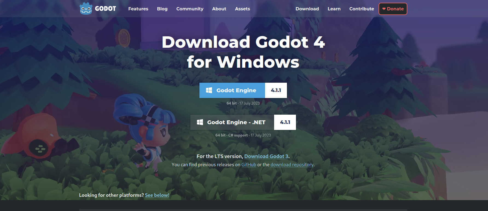
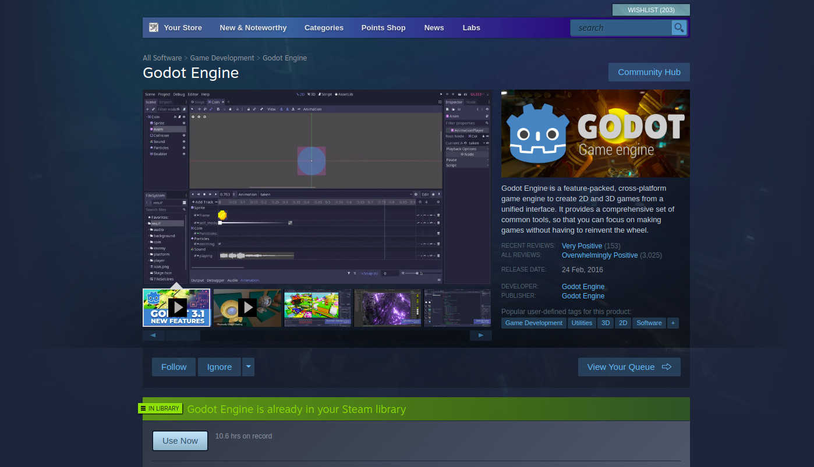
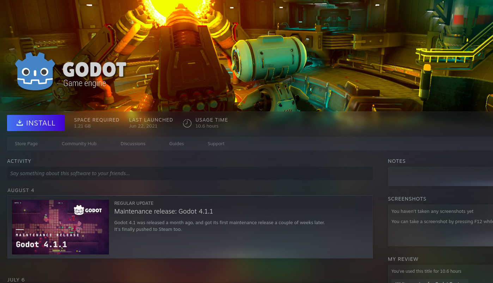
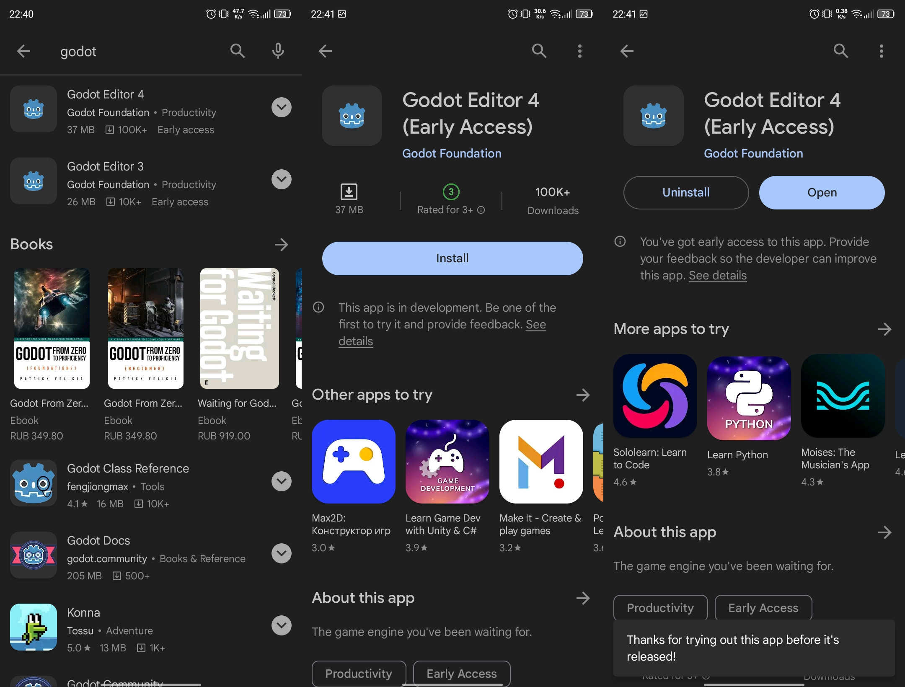
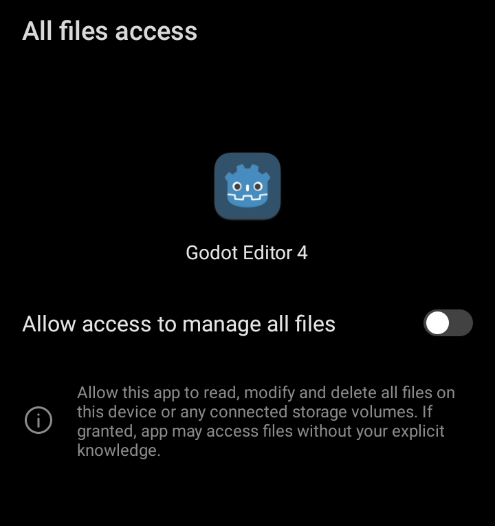
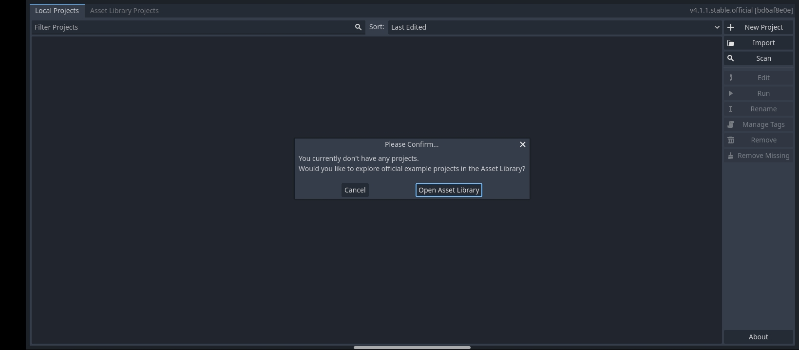
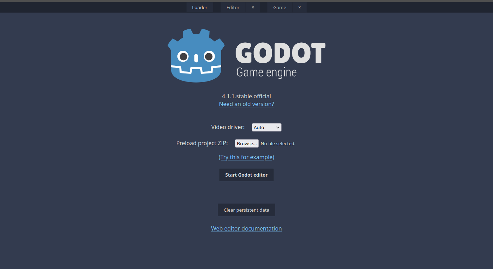
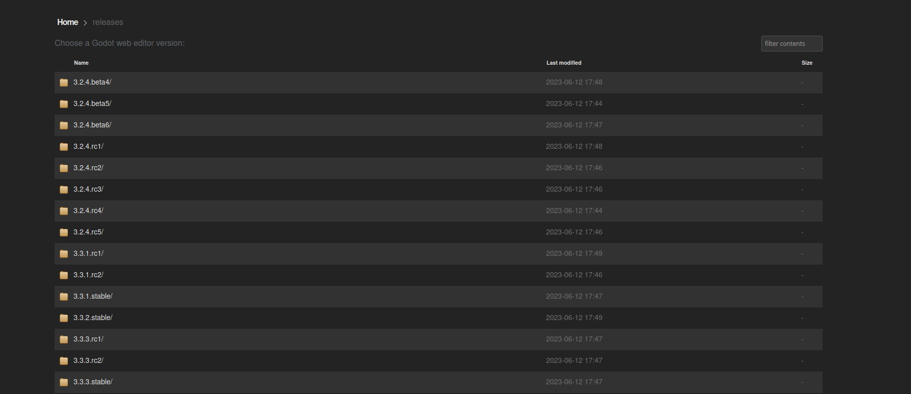

# Как установить Godot

> Автор: Евгений Кучерявый

После недавних новостей с Unity, вам может быть интересно переквалифицироваться на работу с новым движком. Если Unreal Engine вам не нравится, кажется сложным или не тянет на вашем компьютере, то есть отличная замена — Godot.

Это легковесный игровой движок, на котором можно создать игру любой сложности. Также у он полностью бесплатный и с открытым исходным кодом.

## Как установить Godot на Windows

Перейдите на страницу загрузки движка на [официальном сайте Godot](https://godotengine.org/download/windows/). Выберите одну из предложенных версий:

- Обычная — писать игровые скрипты можно только на GDScript. Это собственный язык движка, который напоминает смесь Python и TypeScript.
- .NET — версия с поддержкой C#. Если вы знаете этот язык (например, переключаетесь с Unity), то можете выбрать этот вариант.

По нажатию на кнопку одну из кнопок, у вас начнётся скачивание движка. Архивы весят всего по `~50—60 MB`, так что загрузка закончится быстро. Разархивируйте содержимое в любое удобное для вас место. Внутри должно лежать всего два файла:

- `Godot_v4.1.1-stable_win64.exe` — используется для запуска.
- `Godot_v4.1.1-stable_win64_console.exe` — можно удалить.

Запустите первый файл и всё — движок полностью готов к использованию.

> Если вы выбрали версию .NET, то вам понадобится [установить SDK](https://dotnet.microsoft.com/en-us/download). Перейдите на сайт Microsoft и следуйте инструкциям.

## Как установить Godot на Linux

Для Linux ситуация аналогична. Переходите на сайт, скачиваете архив и извлекаете его содержимое. Внутри будет лежать всего один файл. Запустите его — всё готово.

Также вы можете воспользоваться менеджерами пакетов. Например:

- **apt**: `sudo apt install godot`
- **pamac**: `sudo pacman -Syu godot`

## Как установить Godot через Steam

Простой и универсальный способ, который подходит для всех систем — установка движка через Steam.

Для этого в поиске вбейте `Godot Engine` и откройте первую ссылку. Добавьте движок в библиотеку — это бесплатно.

Перейдите в свою библиотеку, откройте карточку движка и нажмите установить.

Готово.

> Аналогично это работает при установке с помощью Epic Games Store и Itch.io. Но тут есть нюанс: в версии из цифровых магазинов отсутствует поддержка C#.

## Как установить Godot на Android

Если вдруг вы захотите разрабатывать игры на своём смартфоне, то вам повезло — Godot предоставляет такую возможность владельцам устройств на Android.

Всё что для этого нужно, это ввести в поиске в Google Play запрос Godot. Далее вам предложат на выбор версии 3 и 4. LTS-версия (англ. Long Term Support — долгосрочная поддержка) на момент написания 3, но для Android обе с пометкой раннего доступа. Так что будьте готовы к багам и вылетам.

Выберите нужную версию и нажмите установить. Когда файл загрузится и установится, нажмите открыть. Приложение попросит вас дать доступ к файловой системе смартфона. Чтобы пользоваться движком, придётся согласиться. Но мы не можем гарантировать, что с вашим устройством и вашими данными всё будет в порядке.

Как только вы дадите доступ, закройте меню. Вуаля, движок установлен:

> Кстати, тут владельцы смартфонов на Android могут почувствовать себя привилегированными — версии движка для iOS нет.

## Как использовать Godot без установки

Зачем вообще устанавливать движок, если можно использовать его в браузере. Идеальный вариант для тех, кому нужно срочно что-то поправить, а вы далеко от своего компьютера.

Веб-версия доступна [на официальном сайте Godot Engine](https://editor.godotengine.org/releases/4.1.1.stable/godot.editor.html):

Вам может понадобиться возможность настроить видео-драйвер, но по нашему опыту всё работает из коробки в режиме `Auto`. А загрузить свой проект можно в zip-архиве.

Также есть возможность выбрать более старую версию, для этого нажмите на ссылку `Need an old version` и выберите любой из доступных вариантов:

## Заключение

Вот и всё. Установка и запуск этого движка достаточно простые и выполняются буквально в несколько кликов. Скачал, разархивировал, запустил.
