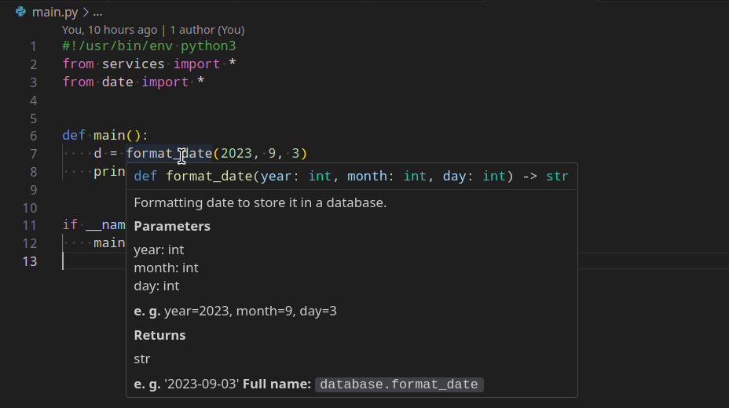

# Почему нельзя использовать `import *` в Python


> Автор: Евгений Кучерявый

Если вы знакомы с ключевым словом `import` в Python, то наверняка слышали, что использовать `import *` — это плохая идея. Может быть вам даже говорили, что именно может пойти не так, мол, что-то там с зоной видимости и конфликтом имён. Так-то оно так, но вот конкретные проблемы демонстрируются редко.

А так как я не только практикующий программист, но и, временами, ментор, то могу поделиться проблемами, с которыми сталкивались мои ученики.

## Почему нельзя использовать `import *` в Python

Давайте рассмотрим проект с вот такой структурой:

- `database.py` — работа с базой данных.
- `date.py` — работа с датами.
- `services.py` — бизнес-логика.
- `main.py` — точка входа приложения.

В файле `database.py` у нас есть метод `format_date`, который подготавливает дату для записи в базу данных:

```
#!/usr/bin/env python3


def format_date(year: int, month: int, day: int) -> str:
    '''Formatting date to store it in a database.

    Parameters
    ----------
    year: int  
    month: int  
    day: int  

    **e. g.** year=2023, month=9, day=3

    Returns
    -------
    str

    **e. g.** '2023-09-03'
    '''
    return f'{year}-{str(month).zfill(2)}-{str(day).zfill(2)}'

```

И в `date.py` у нас есть метод с таким же названием, но он уже форматирует дату из базы данных для вывода её пользователю:

```
#!/usr/bin/env python3


def format_date(value: str) -> str:
    '''Formatting date from database to print it for user

    Parameters
    ----------
    value: str - date from a database

    **e. g.** '2023-09-03'

    Returns
    -------
    str
    **e. g.** 'Date: 03.09.2023'
    '''
    vals = value.split('-')
    return f'Date: {vals[2]}.{vals[1]}.{vals[0]}'

```

Оба метода возвращают строку, но они принимают разные параметры и возвратные значения у них кардинально различаются.

Если мы будем использовать именованный импорт, то проблем у нас никогда не будет. Вот примеры импортов, которые сработают корректно:

```
#!/usr/bin/env python3
import date
import database


date.format_date()
database.format_date()

```

или

```
#!/usr/bin/env python3
from date import format_date as format_date_for_print
from database import format_date as format_date_for_database


format_date_for_print()
format_date_for_database()

```

Однако давайте представим, что мы поленились и использовали `import *`. Вот, для примера, файл `services.py`:

```
#!/usr/bin/env python3
from database import *


def create_user(*args, **kwargs) -> bool:
    pass

```

Сам по себе этот код безобидный и он даже сработает без ошибок. Но давайте представим, что мы снова поленились и импортировали всё из нескольких файлов (`date.py` и `services.py`) в `main.py`:

```
#!/usr/bin/env python3
from services import *
from date import *


def main():
    d = format_date(2023, 9, 3)
    print(d)


if __name__ == '__main__':
    main()

```

На первый взгляд может показаться, что мы импортируем `format_date` из `date.py`, а из `services.py` сюда попадёт только `create_user`, потому что там больше ничего нет. Но на самом деле, когда мы пишем `import *`, мы импортируем вообще всё. В том числе и импорты.

## К каким ошибкам приводит `import *`

Итак, давайте посмотрим, к каким ошибкам приведёт запуск этого кода. В первую очередь стоит отметить, что наш редактор даже подгрузил <b>docstring</b> для метода `format_date`:



И, хотя мы все параметры прописали правильно, в терминале у нас выводится следующая ошибка:

```
evgenii@kucheriavyi λ ~/Projects/ithype/articles/python_imports/  » python main.py
Traceback (most recent call last):
  File "/home/evgenii/Projects/ithype/articles/python_imports/main.py", line 12, in <module>
    main()
  File "/home/evgenii/Projects/ithype/articles/python_imports/main.py", line 7, in main
    d = format_date(2023, 9, 3)
        ^^^^^^^^^^^^^^^^^^^^^^^
TypeError: format_date() takes 1 positional argument but 3 were given

```

Ошибка в том, что `format_date`, импортированный нами в первой строчке, был переопределён во второй. При этом IDE не догадался об этом и подгрузил первую попавшуюся документацию.

Мы можем поменять импорты местами и тогда ошибка пропадёт, а код успешно запустится. Однако IDE всё равно будет показывать некорректную документацию к методу.

## Корректный нейминг решил бы эту проблему

Тут у вас могло возникнуть ощущение, что этой проблемы можно было избежать, если бы мы назвали методы по-разному. Это спорно, потому что:

1. Это допустимый нейминг, потому что:
	1. Он отражает суть метода.
	2. Тут у нас срабатывает инкапсуляция — в рамках своего модуля метод назван отлично и выполняет нужные действия.
2. У вас не всегда есть доступ к названиям методов. Например, они могут импортироваться из сторонних библиотек, и тут вы уже ничего не сделаете. Кроме `import method as my_unique_method_name`.

## Вывод

Чтобы избежать ошибок с импортами, избегайте конструкции `import *`. Это, кстати, поможет соблюдать одно из правил в Дзен Python:

> Явное лучше неявного.

> [GitHub-репозиторий с кодом из этой статьи](https://github.com/ithype/import-all-error)

> Видео о том, почему в Python нельзя использовать `import *`: https://www.youtube.com/watch?v=VU7qtSYK4Q8
